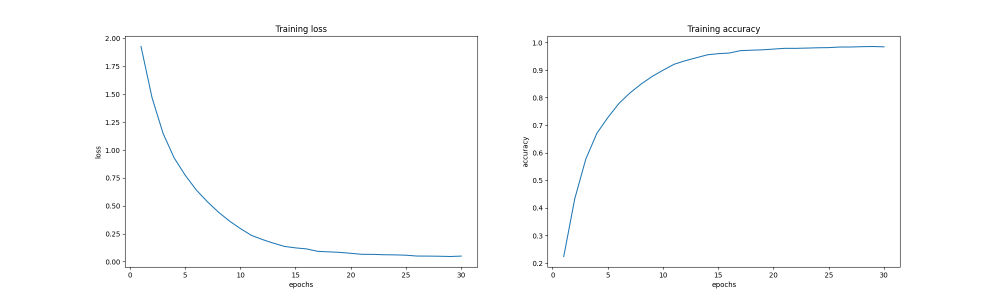

# 实验结果报告
## 版本
* 基于镜像 tensorflow/tensorflow:latest-gpu-py3
* Python@3.6.9
* Tensorflow@2.1.0-gpu
* Keras@2.3.1
* numpy@1.18.1
* matplotlib@2.2.5

* * *
## 1. Image Classification
* 数据集 CIFAR-10
    * 训练集规模：50000
    * 测试集规模：10000
    * 图像尺寸：32 x 32 x 3
    * 输出标签共 10 类
* 数据处理
    * 输入图像只做缩放处理，除以255，取值范围控制在 [0, 1]
    * 输出的预测标签进行 one-hot 编码处理，扩展维度
### 模型 VGG16
* 超参数设置
    * batch_size，训练时 64， 测试时 128
    * 训练轮数 30
    * 优化器 Adam，学习率 1e-4
    * 损失函数 categorical crossentropy

|Training time/minutes|Training acc|Test time/seconds| Test acc|
|--|--|--|--|
|12.95|98.31%|0.714|78.82%|
|12.89|98.72%|0.679|76.65%|
|12.77|98.60%|0.706|77.92%|
|-|-|-|-|
|12.87|98.54%|0.700|77.80%|

(注：最后一行为平均值) 
 

* * *
## 2. Text Sentimnet Analysis
* 数据集 IMDB
    * 训练集规模：25k
    * 测试集规模：25k
    * 二分类，输出结果是影评的情感为正面/负面
* 数据处理
    * 输入数据是单词索引组成的元组，对其采取词嵌入编码 word embedding

### 模型 Bi-LSTM
* 超参数设置
    * batch_size 64
    * 训练轮数 20
    * 优化器 Adam，学习率 1e-4
    * 单词总数 32k
    * 词嵌入维度 64
    * 验证集占训练集比例 0.2
    * dropout=0，即不采取随机失活
    * 评论长度 MAXLEN，超出此长度的被截断，这里并未给出，采取和下个模型相同的参数 128
* 模型结构
    * Embedding
    * Bi-LSTM
    * Bi-LSTM
    * FC
    * FC

|Training time/minutes|Training acc|Validation acc|Test time/seconds| Test acc|
|--|--|--|--|--|
|34.19|99.78%|84.46%|19.787|82.06%|
|32.62|99.85%|83.50%|19.060|82.99%|
|32.84|99.92%|84.30%|18.703|82.93%|
|-|-|-|-|
|33.21|99.85%|84.08%|19.183|82.66%|
 
 

注：虚线为训练集，实线为验证集；  
从图像来看，存在过拟合问题，可能因为没有采取正则化；  
LSTM适于分析全局的长期性结构，在情感分析问题上表现得差一些。

### 模型 Bert Large Uncased 768-hidden
* Bert 使用了 Transformer 这种 Attention 机制
    * Trasnformer 原型含有：接受文本输入的编码器 encoder，以及预测输出结果的解码器 decoder；
    * 与按顺序依次读取文本不同，编码器一次读取整个单词序列，因此被认为是双向的；
* Bert 的训练方法：
    * MLM：替换 15% 的单词为 [MASK]，然后将编码器的输出输入分类器，关注每个遮掩掉的单词的预测结果，也就是分类属于各单词的概率；
    * NSP：接收成对的句子作为输入，预测第二句话是否为第一句话在原文中的后一句。为了区分开两个句子，将在第一句开头插入[CLS]，在每一句结尾插入[SEP]。
    * Bert 训练时，结合了上面两种方法，以降低两个方法的综合损失为训练目标。
* 下面将从两个不同的库导入 bert 模型，但是总的流程一致：
    * 加载数据，此处选择从 github 加载excel数据，[链接](https://github.com/laxmimerit/IMDB-Movie-Reviews-Large-Dataset-50k.git)，训练集和测试集的形状都是 (25000, 2)，即25k条数据，每条数据都有 Reviews, Sentiment(pos/neg) 两个特征；
    * 处理数据：
        * 初步整理数据，比如去掉评论里多余的空格、标点符号等，将感受转换为 1-pos, 0-neg；
        * 加载预训练的 bert tokenizer，输入文本，得到文本经划分后、转换的数字序列；
        * 整理序列，限制长度在 MAXLEN 以内，不足的补充，此时训练集和测试集，输入数据为 (25k, MAXLEN)，标签为 (25k, 2)
    * 加载预训练的 bert 分类器，建立模型，设置优化器和损失函数；
    * 训练模型，训练结束后在测试集上评估模型表现（此处不划分验证集）。

#### 1. bert-for-tf2
* pip install bert-for-tf2
* 超参数设置
    * batch-size 32
    * 训练轮数 3
    * 优化器 AdamW，学习率 1e-5，衰减参数 1e-6
    * MAXLEN 128
* 网络结构：采取如下所示的，自己设置的模型
    * 加载预训练的 bert 分类器
    * 展开，加上一层全连接层
    * 应用 Dropout，取需要丢弃的比例为 0.3
    * 最后加上输出层，应用 sigmoid 激活函数，输出二分类结果

* 训练结果如下。如果应用 Adam 而非 AdamW 优化器，模型表现还会略有上升。

|Training time/minutes|Training acc|Test time/seconds| Test acc|
|--|--|--|--|
|37.58|85.30%|57.25|92.74%|
|34.73|85.74%|58.49|91.82%|
|33.48|85.71%|58.08|91.53%|
|-|-|-|-|
|35.26|85.58%|57.49|92.03%|

* 参考
    * 基于预训练部分做编码 encoding [链接](https://stackabuse.com/text-classification-with-bert-tokenizer-and-tf-2-0-in-python/)
    * 数据[下载](https://github.com/laxmimerit/IMDB-Movie-Reviews-Large-Dataset-50k.git)

#### 2. huggingface/transformers
* pip install transformers
* 超参数设置
    * batch-size 32
    * 训练轮数 3
    * MAXLEN 128
    * 优化器 Adam，alpha - 1e-5, epsilon - 1e-5, clipnorm - 1.0

* 加载的模型和 Pytorch 中的一样，为 huggingface/transformers/TFBertForSequenceClassification

* 训练结果如下

|Training time/minutes|Training acc|Test time/seconds| Test acc|
|--|--|--|--|
|16.28|93.23%|116.18|97.49%|
|16.32|93.20%|115.04|97.53%|
|16.33|93.36%|115.80|97.86%|
|-|-|-|-|
|16.31|93.26%|115.67|97.63%|

#### 总结
* 调用 huggingface/transformers 的效果更好一些；
* 不论使用哪个预训练的模型，都观察到，测试集的准确率明显高于训练集
    * 尝试交换训练集和测试集的数据，发现结果不变，依然是在作为测试集的数据集上准确率更高一些，所以和数据质量大概率无关；
    * 尝试用训练完的模型，再次评估训练集，发现结果和测试集差不多，推测是模型训练的问题。

* * *
## 3. Image Generation
* 数据集 MNIST 手写数字识别
    * 图像尺寸：28 x 28 x 1
* 数据处理
    * 归一化到 [-0.5, 0.5]
### GAN
* GANs，生成对抗网络，两个模型通过对抗过程同时训练
    * 生成器，输入随机向量，根据向量输出合成图像；
    * 判别器，输入一张图像，判断该图像是来自训练集的真实图像，还是来自生成器的合成图像；
    * 训练过程中，二者的能力都逐渐增强，生成器逐渐生成越来越真实的图像，而判别器也不断提高自己的判断标准；
    * GAN 优化的最小值是不固定的，因为系统在动态改变，训练最终达到生成器和判别器之间的平衡。
* GAN 的一些常用技巧：
    * 最后一层的激活函数常用 tanh
    * 用正态分布在空间中随机采点
    * 随机性可以提高稳健性：dropout & 随机噪声
    * 稀疏的梯度会阻碍 GAN 的训练，步进卷积代替最大池化，LeakyReLU 代替 ReLU
        * 卷积操作的本质是，在输入矩阵和 kernel 之间逐元素相乘然后求和，建立输入和输出之间，多对一的位置性关系；
        * 卷积矩阵，是重排了 kernel，每一行都是 kernel 展开，填充0得到。例如输入矩阵为4x4，核为3x3，那么将核转换为卷积矩阵 4x16，乘上输入矩阵的展开列向量 16x1，最终结果 4x1 就是原来的输出矩阵 2x2 展开。
        * 转置卷积，就是使用卷积矩阵的转置，比如上例中，16x4 的转置矩阵，可以将 1x4 的矩阵映射为 1x9，建立一对多的关系，是一种可学习的上采样方法。
    * 生成图像的棋盘伪影，是像素空间覆盖不均匀导致的，注意卷积层内核大小和步幅大小
### 模型 DcGAN
* 超参数设置
    * batch-size 64
    * 训练轮数 20
    * 优化器 Adam，学习率 2e-4，betas (0.5, 0.999)
* 生成器模型

* 判别器模型

* 损失函数取二元交叉熵。生成器考虑生成图片是否被判定为真，判别器考虑是否判定生成图片为假，以及是否判定原图片为真；
* 优化器都采取 Adam，参数设置相同；
* 每轮训练分批进行，对于每个训练步骤（一个batch）：
    * 生成随机向量，输入生成器，得到生成图像；
    * 然后用判别器判定生成图像和真实图像，得到判定结果；
    * 计算生成器和判别器的损失函数；
    * 计算生成器和判别器的梯度；
    * 应用优化器，更新模型参数。

#### 模型实现
1. dcgan_tutorial.py，根据tf官方教程，修改了部分超参数，参考[链接](https://www.tensorflow.org/tutorials/generative/dcgan?hl=zh-cn)
2. dcgan_keras.py，参考《Python 深度学习》，基于 Keras 实现，训练结果不理想。可能需要再对超参数做调整，因为书上是针对 cifar 数据集、生成某一类图片，做的训练。

#### 实验结果
|Generator loss|Discriminator loss|Training time/seconds|
|--|--|--|
|1.047|1.146|173.62|
|1.091|1.122|173.10|
|1.069|1.132|172.21|
|-|-|-|
|1.069|1.133|172.98|

(注：损失函数计算错误，已修正)  
20轮训练以后得到的生成图像  

* 存在问题：
    * 损失的计算，是累计了各个批次的损失，除以总样本数得到，但是和 Pytorch 结果相差较远。

* * *
## 4. Image Translation
* 数据集 horse and zebra from ImageNet
    * 加载自 cycle_gan/horse2zebra
    * 训练集，马的图片 1067， 斑马的图片 1334
    * 测试集，马的图片 120，斑马的图片 140
    * 图像尺寸：3 x 256 x 256
* 数据处理
    * 归一化到 [-0.5, 0.5]
    * 对于训练图像，还需要先缩放到 286x286，然后随机剪裁到 256x256，最后随机左右翻转
### 模型 Cycle GAN
* 超参数设置
    * batch-size 8
    * 训练轮数 100
    * 优化器 Adam，学习率 2e-4，beta_1 0.5
* 图像共两类，马记作X，斑马记作Y
    * 生成器 g(X) = fake_Y
    * 生成器 f(Y) = fake_X
    * 判别器 dx，区分原来的X和生成的X
    * 判别器 gy，区分原来的Y和生成的Y
    * 模型均从 pix2pix 直接加载，采取 instancenorm 正则化
* 损失函数
    * 判别器的损失函数，采取二元交叉熵 -> 真实图像是否判断为1 & 生成图像是否判断为0
    * 生成器的损失函数也采取二元交叉熵，包括：
        * 生成的图片是否被判定为真
        * 循环一致损失，f(g(x)) 和 x 是否一致，g(f(y)) 和 y 是否一致
        * 一致性损失，生成器g，输入y是否不变，生成器f，输入x是否不变
* 优化器：生成器和判别器都采取 Adam 优化器，参数一致
* 训练：对于每一轮迭代，枚举训练集的批，计算四个模型的损失函数和梯度，使用优化器更新参数。
#### 实验结果
<!-- 1. 100轮训练，批量为8
* 总用时 156.12 分钟，平均每轮 93.7 秒
* losses: g - 0.326, f - 0.209, dx - 0.0778, dy - 0.0384
* 问题：
    * 训练效果不好；
    * 将马转换为斑马的生成器 g，明显误差高于另一个生成器 f，目前从训练结果来看，g的训练效果也不是很好。

2. 40轮训练，批量为8，分批时设置 drop_remainder=True
* 总用时 62.62 分钟，平均每轮 93.9 秒
* losses: g - 0.271, f - 0.215, dx - 0.0803, dy - 0.0595
* 问题：
    * 两个生成器的损失，在刚开始时十分接近，但是随着训练进行，差距越来越大；
    * 训练效果相比1有所进步，但还是有些粗糙，马到斑马依然存在重影问题，斑马到马存在着色不全、不均匀的问题；
    * 尝试不同的 batch_size 发现，批量设置不同，累计损失也不同。

3. 尝试使用教程的参数设置：40轮训练，批量为1，图像归一化为 [-1, 1]
* 总用时 206.22 分钟，平均每轮 309.33 秒
* losses: g - 3.405, f - 2.561, dx - 0.601, dy - 0.378
* 同样出现了生成器相差较大的问题；
* 在测试集上表现和 2 相近，对于背景和马相差较大的图片，转换效果更好一些；
* 在训练集上的表现较好，如以下两张图：

 -->

* 训练轮数 100
* 总用时 9417.55 secs / 156.96 mins，平局每轮用时 94.18 secs
* 训练开始和结束时的 losses

|generator g|generator f|discriminator dx| discriminator dy|
|--|--|--|--|
|3.380|3.310|0.718|0.717|
|2.377|1.642|0.630|0.370|

* 在测试集上的表现

* 注：
    * 损失函数的计算之前存在问题，已修复；
    * 两个生成器的表现差距较大，可能因为进行的工作不同，从结果来看，生成器g将马转换为斑马，表现更差一些；
    * 注意到最终转换效果，其实和目标物体在图片上是否容易识别也有一定的关系，比如马/斑马的大小、颜色和背景的接近程度等。推测，正是由于斑马颜色和背景差距较大，所以生成器f的表现更好；
    * 从测试集来看，依然存在一些问题，比如g转换出的斑马容易有重影、误改变了背景颜色，f转换马时，容易有上色不均匀、不明显等问题。