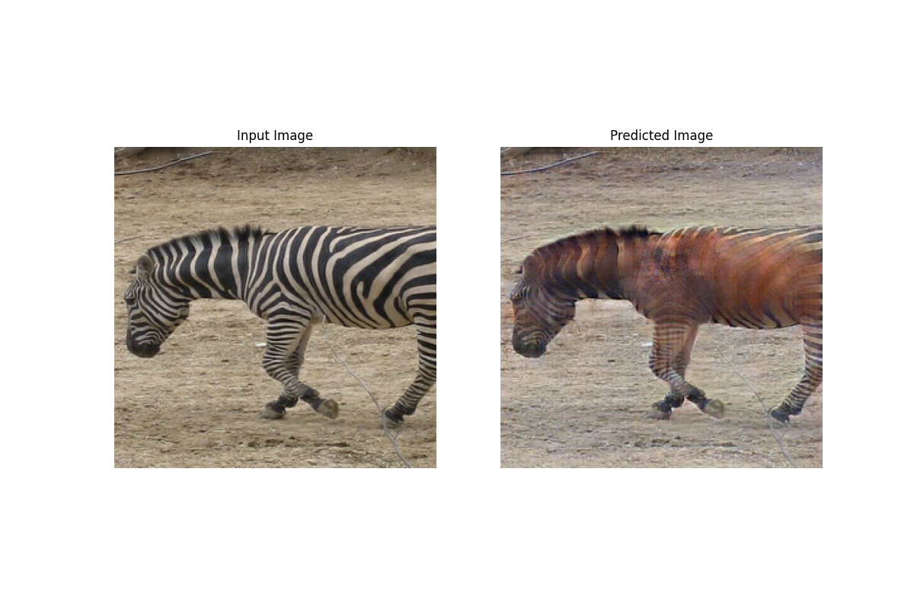

# 实验结果报告
## 版本
* 基于镜像 tensorflow/tensorflow:latest-gpu-py3
* Python@3.6.9
* Tensorflow@2.1.0-gpu
* Keras@2.3.1
* numpy@1.18.1
* matplotlib@2.2.5

* * *
## 1. Image Classification
* 数据集 CIFAR-10
    * 训练集规模：50000
    * 测试集规模：10000
    * 图像尺寸：32 x 32 x 3
    * 输出标签共 10 类
* 数据处理
    * 输入图像只做缩放处理，除以255，取值范围控制在 [0, 1]
    * 输出的预测标签进行 one-hot 编码处理

### 模型 VGG16
* 超参数设置
    * batch_size，训练时 64， 测试时 128
    * 训练轮数 30
    * 优化器 Adam，lr=1e-4
    * 损失函数 categorical_crossentropy
* 模型输入形状设计为 (None, 32, 32, 3)，卷积基部分不变，重写分类器
    * 展开得到 512
    * FC层 -> 4096，应用激活函数 relu
    * Dropout(0.5)
    * FC层 -> 4096，应用激活函数 relu
    * Dropout(0.5)
    * 输出层 -> 10，应用分类函数 softmax
* 模型结构为：

### 实验结果

|Training time/minutes|Training acc|Test time/seconds|Test acc|备注|
|--|--|--|--|--|
|20.55|98.57%|1.185|78.55%|分类器无Dropout层|
|13.22|98.67%|1.192|78.54%|添加Dropout层|
|13.28|98.82%|1.180|78.28%||
|13.37|98.44%|1.182|78.47%||
|-|-|-|-|-|
|13.29|98.64%|1.185|78.43%|均值|
 
* loss-epochs, acc-epochs 图如下

* * *
## 2. Text Sentiment Analysis - BiLSTM
* 数据集 IMDB
    * 训练集规模：25k
    * 测试集规模：25k
    * 二分类，输出结果是影评的情感为正面/负面
* 数据处理
    * 输入数据是单词索引组成的元组，对其采取词嵌入编码 word embedding

### 模型 Bi-LSTM
* 超参数设置
    * batch_size 64
    * 训练轮数 20
    * 优化器 Adam，lr=1e-4
    * 单词总数 32650
    * 词嵌入维度 64
    * dropout = 0
    * 评论的长度不进行截断
    * （Pytorch 一开始设置了验证集占训练集比例 0.2，但是后来通过注释取消了验证集）

* 模型结构
    * Embedding
    * 两层 Bi-LSTM
    * 两层 FC

### 实验结果
<!-- * 进行的一些修正：不限制输入字符串的长度，修正运行时间为 time.time()，取消验证集 -->

|Training time/minutes|Training acc|Test time/seconds| Test acc|
|--|--|--|--|--|
|21.53|99.83%|18.103|82.47%|
|21.72|99.31%|18.265|82.20%|
|22.77|99.97%|19.976|84.11%|
|-|-|-|-|
|22.01|99.70%|18.781|82.93%|

* 修正：取消测试集作为验证集，添加嵌入层和全连接层的初始化，每轮的训练步数取整到 390
* 结果
    * 训练时间 15.37 分钟，测试时间 18.80 秒；
    * 训练集准确率为 0.9844，测试集准确率为 0.8375

<!-- * loss-epochs, acc-epochs 图像如下，虚线为训练集，实线为测试集（这里将测试集作为验证集使用）
* 存在问题
    * 从图像来看，存在过拟合问题，可能因为没有采取正则化；  
    * 在测试集上的表现较差，可能因为 LSTM 适于分析全局的长期性结构，在情感分析问题上表现得差一些。

  -->

* * * 
## 3. Text Sentiment Analysis - Bert
* 数据集 IMDB
    * 训练集规模：25k
    * 测试集规模：25k
    * 二分类，输出结果是影评的情感为正面/负面

### 模型 Bert Large Uncased 768-hidden
* Bert 使用了 Transformer 这种 Attention 机制
    * Trasnformer 原型含有：接受文本输入的编码器 encoder，以及预测输出结果的解码器 decoder；
    * 与按顺序依次读取文本不同，编码器一次读取整个单词序列，因此被认为是双向的；
* Bert 的训练方法：
    * MLM：替换 15% 的单词为 [MASK]，然后将编码器的输出输入分类器，关注每个遮掩掉的单词的预测结果，也就是分类属于各单词的概率；
    * NSP：接收成对的句子作为输入，预测第二句话是否为第一句话在原文中的后一句。为了区分开两个句子，将在第一句开头插入[CLS]，在每一句结尾插入[SEP]。

#### 实验设计
* 超参数设置
    * batch-size 32
    * 训练轮数 3
    * MAXLEN 128
    * 优化器
        * 在Pytorch中，调用 transformers.AdamW() 设置优化器的 lr, epsilon，注意到参数 weight_decay 使用默认值0；
        * 然后调用 transformers 中的方法，get_linear_schedule_with_warmup() 设置学习率；
        * 但是对于 tf2，transformers 中创建对应优化器的方法不同：
        * transformers.create_optimizer() -> [link](https://huggingface.co/transformers/_modules/transformers/optimization_tf.html#WarmUp)
            * init_lr = 1e-5
            * num_train_steps，计算训练总步数
            * num_warmup_steps = 0
            * adam_epsilon = 1e-5
            * weight_decay_rate，默认为0，返回 Adam 优化器，只有设置大于0时，才返回 AdamWeightDecay 优化器。所以此处使用默认参数，Adam 优化器。
    <!-- * 优化器 AdamWeightDecay (import from transformers)
        * lr = 1e-5 (default 1e-3)
        * epsilon = 1e-5 (default 1e-6)
        * clipnorm = 1.0
        * 其余默认值：beta_1 = 0.9, beta_2 = 0.999, weight_decay_rate = 0 -->
    * dropout = 0, embeded_size = 16，未使用这两个参数
    * config 不进行调整，transformers.BertConfig 中，并无 Pytorch 调整的内容

* 实验流程
    * 安装模型库 huggingface/transformers -> pip install transformers
    * 加载数据，从tfds中，直接加载'imdb_reviews/plain_text'，训练集和测试集的样本数都是 25k
    * 加载预训练的 BertTokenizer，调用 encode_plus() 对读取的评论进行处理
        * add_special_tokens=True // 添加特殊字符
        * max_length=MAXLEN // 截取评论长度
        * pad_to_max_length=True // 长度不足的进行补充
    * 数据经编码处理后，进行字典映射，才能作为输入数据
        * input_ids, 分词对应的数字
        * attention_mask, 有分词处为1，其余填充的部分为0
        * token_type_ids, 进行上下文预测时，第一句为0，第二句为1，此处均为0
    * 加载预训练的分类器 TFBertForSequenceClassification，建立模型，设置优化器和损失函数；
    * 训练模型，训练结束后在测试集上评估模型表现。
* 模型结构
     

### 实验结果

|Training time/minutes|Training acc|Test time/seconds|Test acc|备注|
|--|--|--|--|--|
|16.00|92.91%|110.62|88.79%||
|16.01|92.96%|111.13|88.66%||
|16.08|92.64%|111.63|88.63%||
|-|-|-|-|-|
|16.03|92.84%|111.13|88.69%||
|-|-|-|-|-|
|107.61|97.66%|555.37|93.17%|hyper_params:  batch_size=6, maxlen=512,  lr=2e-5, epsilon=1e-8|

* 经过输入数据的修正，训练前期，测试集的准确率高于训练集，后期低于训练集；
* 修正后，bert 在测试集上的表现大大下降，可能和采取的数据处理也有关系。

* * *
## 4. Image Generation
* 数据集 MNIST 手写数字识别
    * 图像尺寸：28 x 28 x 1
* 数据处理
    * 归一化到 [-0.5, 0.5]
    * 缩放图像到 64 x 64 x 1

### GAN
* GANs，生成对抗网络，两个模型通过对抗过程同时训练
    * 生成器，输入随机向量，根据向量输出合成图像；
    * 判别器，输入一张图像，判断该图像是来自训练集的真实图像，还是来自生成器的合成图像；
    * 训练过程中，二者的能力都逐渐增强，生成器逐渐生成越来越真实的图像，而判别器也不断提高自己的判断标准；
    * GAN 优化的最小值是不固定的，因为系统在动态改变，训练最终达到生成器和判别器之间的平衡。
<!-- * GAN 的一些常用技巧：
    * 最后一层的激活函数常用 tanh
    * 用正态分布在空间中随机采点
    * 随机性可以提高稳健性：dropout & 随机噪声
    * 稀疏的梯度会阻碍 GAN 的训练，步进卷积代替最大池化，LeakyReLU 代替 ReLU
        * 卷积操作的本质是，在输入矩阵和 kernel 之间逐元素相乘然后求和，建立输入和输出之间，多对一的位置性关系；
        * 卷积矩阵，是重排了 kernel，每一行都是 kernel 展开，填充0得到。例如输入矩阵为4x4，核为3x3，那么将核转换为卷积矩阵 4x16，乘上输入矩阵的展开列向量 16x1，最终结果 4x1 就是原来的输出矩阵 2x2 展开。
        * 转置卷积，就是使用卷积矩阵的转置，比如上例中，16x4 的转置矩阵，可以将 1x4 的矩阵映射为 1x9，建立一对多的关系，是一种可学习的上采样方法。
    * 生成图像的棋盘伪影，是像素空间覆盖不均匀导致的，注意卷积层内核大小和步幅大小 -->

### 模型 DcGAN
* 超参数设置
    * batch-size 64
    * 训练轮数 20
    * 优化器 Adam，学习率 2e-4，betas (0.5, 0.999)
    * 生成器和判别器的特征图均为 64 x 64
    * 生成器输入随机向量的维度是 100
* 损失函数取二元交叉熵。生成器考虑生成图片是否被判定为真，判别器考虑是否判定生成图片为假，以及是否判定原图片为真；
* 优化器都采取 Adam，参数设置相同；
* 每轮训练分批进行，对于每个训练步骤（一个batch）：
    * 生成随机向量，输入生成器，得到生成图像；
    * 然后用判别器判定生成图像和真实图像，得到判定结果；
    * 计算生成器和判别器的损失函数；
    * 计算生成器和判别器的梯度；
    * 应用优化器，更新模型参数。

#### 实验结果
1. 采取tf官方教程的模型，实现文件为 dcgan_tutorial.py
* 生成器模型
     
* 判别器模型
     

|Generator loss|Discriminator loss|Training time/minutes|
|--|--|--|
|1.047|1.146|2.89|
|1.091|1.122|2.89|
|1.069|1.132|2.87|
|-|-|-|
|1.069|1.133|2.88|

2. 采取和 pytorch 相同的模型
* 生成器模型
     
* 判别器模型
     

|Generator loss|Discriminator loss|Training time/minutes|
|--|--|--|
|0.693|1.006|9.51|

* 存在问题：损失很快收敛到 generator - 0.693, discriminator - 1.006 不再变化，作为 dcgan 的损失问题较大，正常应该是生成器的损失较大，判别器的损失较小（0.6左右），生成的图像如上，效果不是很好。

* * *
## 5. Image Translation
* 数据集 horse and zebra from ImageNet
    * 加载自 cycle_gan/horse2zebra
    * 训练集，马的图片 1067， 斑马的图片 1334
    * 测试集，马的图片 120，斑马的图片 140
    * 图像尺寸：3 x 256 x 256
* 数据处理
    * 归一化到 [-0.5, 0.5]
    * 对于训练图像，还需要先缩放到 286x286，然后随机剪裁到 256x256，最后随机左右翻转
### 模型 Cycle GAN
* 超参数设置
    * batch-size 8
    * 训练轮数 100
    * 优化器 Adam，学习率 2e-4，beta_1 0.5
* 图像共两类，马记作X，斑马记作Y
    * 生成器 g(X) = fake_Y
    * 生成器 f(Y) = fake_X
    * 判别器 dx，区分原来的X和生成的X
    * 判别器 gy，区分原来的Y和生成的Y
    * 模型均从 pix2pix 直接加载，采取 instancenorm 正则化
* 损失函数
    * 判别器的损失函数，采取二元交叉熵 -> 真实图像是否判断为1 & 生成图像是否判断为0
    * 生成器的损失函数也采取二元交叉熵，包括：
        * 生成的图片是否被判定为真
        * 循环一致损失，f(g(x)) 和 x 是否一致，g(f(y)) 和 y 是否一致
        * 一致性损失，生成器g，输入y是否不变，生成器f，输入x是否不变
* 优化器：生成器和判别器都采取 Adam 优化器，参数一致
* 训练：对于每一轮迭代，枚举训练集的批，计算四个模型的损失函数和梯度，使用优化器更新参数。
#### 实验结果
* 训练轮数 100
* 总用时 9417.55 secs / 156.96 mins，平局每轮用时 94.18 secs
* 训练开始和结束时的 losses

|generator g|generator f|discriminator dx| discriminator dy|
|--|--|--|--|
|3.380|3.310|0.718|0.717|
|2.377|1.642|0.630|0.370|

* 在测试集上的表现

* 注：
    * 损失函数的计算之前存在问题，已修复；
    * 两个生成器的表现差距较大，可能因为进行的工作不同，从结果来看，生成器g将马转换为斑马，表现更差一些；
    * 注意到最终转换效果，其实和目标物体在图片上是否容易识别也有一定的关系，比如马/斑马的大小、颜色和背景的接近程度等。推测，正是由于斑马颜色和背景差距较大，所以生成器f的表现更好；
    * 从测试集来看，依然存在一些问题，比如g转换出的斑马容易有重影、误改变了背景颜色，f转换马时，容易有上色不均匀、不明显等问题。

* * *
## 对比

|Model|Framework|Test acc|Training time|Test time|备注|
|--|--|--|--|--|--|
|VGG16|Pytorch|76.57%|26.93 min|4.235 s|
||Tensorflow|78.43%|13.29 min|1.185 s|？训练和测试时间较短|
|BiLSTM|Pytorch|98.6%|5.05 min|5.74 s|准确率有误 测试结果：84.6%|
||Tensorflow|83.75%|15.37 min|18.80 s|？训练和测试时间较长|
|Bert|Pytorch|98.2%|16.24 min|196.96 s|准确率有误 测试结果：93.9%|
||Tensorflow|88.69%|16.03 min|111.13 s|训练集准确率为 92% 左右 ？测试集上模型准确率较低|

|Model|Framework|Disc loss|Gen loss|Time|备注|
|--|--|--|--|--|--|
|DCGAN|Pytorch|0.4969|3.1592|20.45 min||
||Tensorflow|1.006|0.693|9.51 min|？生成图像效果较差， 损失存在问题|
||Tensorflow|1.133|1.069|2.88 min|采取tf-tutorial示例的模型|